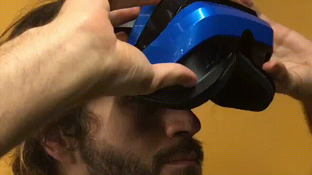
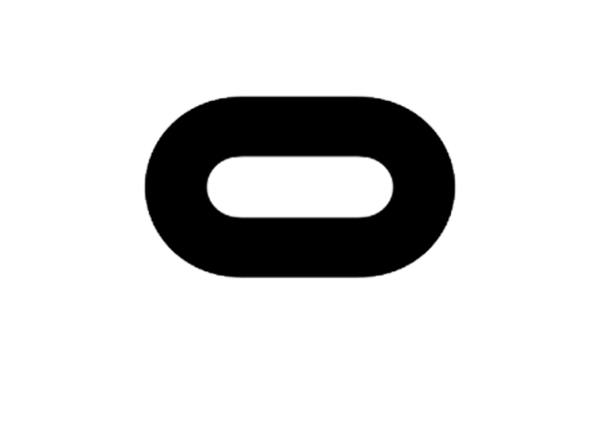
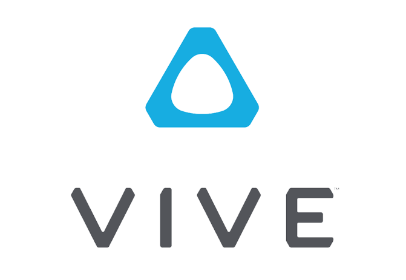
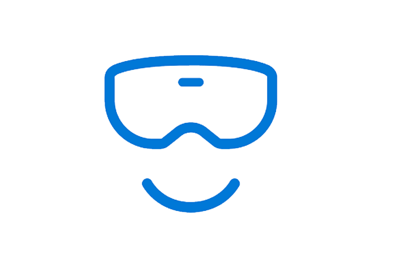
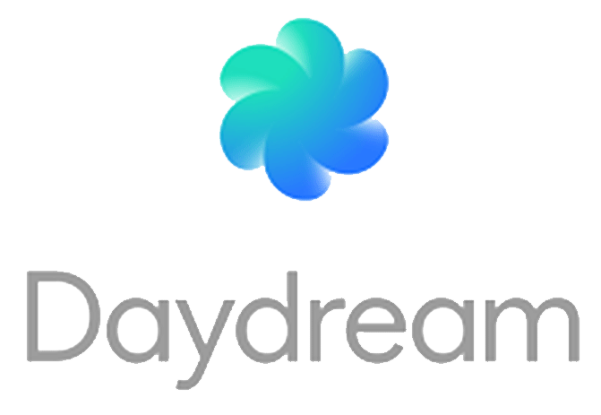
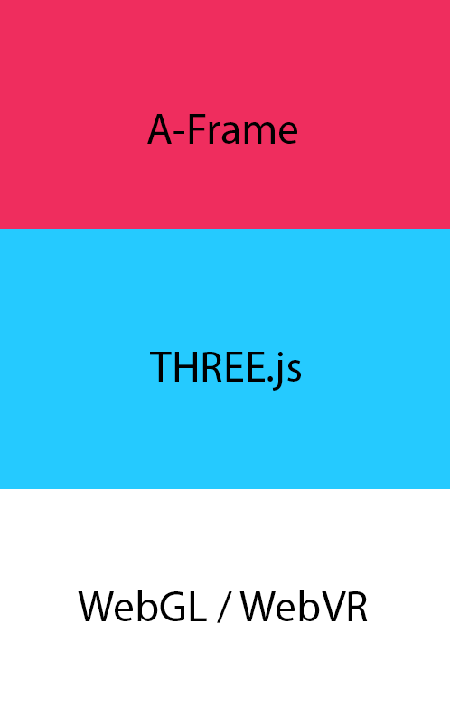

<!-- .slide: data-background="media/img/aframe.jpg" -->

  <h1>A-Frame</h1>
  
A Web framework for building VR experiences

  

    @dmarcos | **aframe.io**
  

<!-- NOTES -->
- Next week is A-Frame's 2nd aniverssary.
- Why:
  - Onboard Web developers into the 3D and VR world with tools that are familiar to them.
  - Vehicle to kickstart WebVR ecosystem and prepare for a post 2D display world.
  - Prototype and experiment WebVR and VR UX faster.
------

# A-Frame design goals

  
On board Web Developers into VR

  

------

# A-Frame design goals

Support of all headsets out of the box

  

    
    <i>Oculus</i>
  

  

    
    <i>HTC Vive</i>
  

  

    
    <i>Windows Mixed Reality</i>
  

  

    
    <i>Daydream</i>
  

  

    
    <i>Gear VR</i>
  

  

    
    <i>Cardboard</i>
  

------

# A-Frame

  

    
    <i>200+ contributors</i>
  

  

    
    <i>5000+ members on Slack</i>
  

  

    
    <i>100s of featured projects</i>
  

<!-- NOTES -->
- Next week is the 2nd anniversary
- Active community on Slack to share projects, interact, hang out, seek help
- Featured projects on the `awesome-aframe` repository and *A Week of A-Frame* blog
------

# What is WebVR?

A JavaScript API for websites to interface with VR hardware.

------

# A-Frame stack

  

------

  
Entity Component architecture built into HTML

<!-- NOTES -->
- Demo:
https://glitch.com/edit/#!/aframe-siggraph-asia 
- `<a-sky color="#ECECEC"></a-sky>`
- `<a-box position="-1 0.5 -3" rotation="0 45 0" color="#4CC3D9" shadow></a-box>`
- `<a-sphere position="0 1.25 -5" radius="1.25" color="#EF2D5E" shadow></a-sphere>`
- `<a-cylinder position="1 0.75 -3" radius="0.5" height="1.5" color="#FFC65D" shadow></a-cylinder>`
- `<a-plane position="0 0 -4" rotation="-90 0 0" width="4" height="4" color="#7BC8A4" shadow></a-plane>`
- `<a-animation attribute="rotation" to="0 360 0" easing="linear" repeat="indefinite"></a-animation>`
- `<a-entity obj-model="obj: url(https://cdn.glitch.com/5a9a1bc6-9f94-436c-b782-4d9429365703%2Frocket.obj?1511926311589); mtl: url(https://cdn.glitch.com/5a9a1bc6-9f94-436c-b782-4d9429365703%2Frocket.mtl?1511926307553)" 
position="2 1 -5" rotation="0 90 0"></a-entity>`
- `<a-entity raycaster="far: 30; objects: .intersectable"
             cursor
             geometry="primitive: ring; radiusOuter: 0.015;
                       radiusInner: 0.01; segmentsTheta: 32"
             material="color: #283644; shader: flat"
            position="0 0 -0.75"></a-entity>`
- `https://aframe.io/a-saturday-night/`
- Some people at this point say. Oh it is like VRML.
- Is an entity-component framework.
- All objects in scene are **entities** that inherently empty objects. Plug in
  **components** to attach appearance / behavior / functionality
- 2D web where every element was fixed
- 3D/VR is different, objects of infinite types and complexities, need an easy way to build up different kinds of objects

------

  
<b>Demo: </b>https://aframe-siggraph-asia.glitch.me/

------

# The Web we love

<!-- NOTES -->
- `https://www.underconsideration.com/brandnew/archives/mozilla_2017_logo.png`
- `https://aframe.io/examples/hello-metaverse/`

------

# Community Examples

https://aframe.io/blog/

------

<blockquote class="twitter-tweet">
<a href="https://twitter.com/hashtag/codevember?src=hash&amp;ref_src=twsrc%5Etfw">#codevember</a> #13 simple <a href="https://twitter.com/hashtag/orange?src=hash&amp;ref_src=twsrc%5Etfw">#orange</a> launcher, having fun with <a href="https://twitter.com/donrmccurdy?ref_src=twsrc%5Etfw">@donrmccurdy</a>&#39;s <a href="https://twitter.com/aframevr?ref_src=twsrc%5Etfw">@aframevr</a> <a href="https://twitter.com/hashtag/physics?src=hash&amp;ref_src=twsrc%5Etfw">#physics</a>. view in browser tap/click to fire <a href="https://t.co/BQVduDQZmR">https://t.co/BQVduDQZmR</a> code &amp; credits: <a href="https://t.co/U3ssR1Frca">https://t.co/U3ssR1Frca</a> <a href="https://t.co/T1Wq8EtO25">pic.twitter.com/T1Wq8EtO25</a>
&mdash; Kieran Farr (@kfarr) <a href="https://twitter.com/kfarr/status/930333161271173120?ref_src=twsrc%5Etfw">November 14, 2017</a></blockquote>

------

<blockquote class="twitter-tweet">
Is detachable editable website the future of VR? I think YES! <a href="https://twitter.com/hashtag/VR?src=hash&amp;ref_src=twsrc%5Etfw">#VR</a> <a href="https://twitter.com/hashtag/web?src=hash&amp;ref_src=twsrc%5Etfw">#web</a> <a href="https://twitter.com/hashtag/Virtualreality?src=hash&amp;ref_src=twsrc%5Etfw">#Virtualreality</a> <a href="https://twitter.com/hashtag/WebVR?src=hash&amp;ref_src=twsrc%5Etfw">#WebVR</a> <a href="https://twitter.com/hashtag/UX?src=hash&amp;ref_src=twsrc%5Etfw">#UX</a> <a href="https://twitter.com/hashtag/webdev?src=hash&amp;ref_src=twsrc%5Etfw">#webdev</a> <a href="https://twitter.com/hashtag/VRUX?src=hash&amp;ref_src=twsrc%5Etfw">#VRUX</a> <a href="https://t.co/Qhd9a68KWl">pic.twitter.com/Qhd9a68KWl</a>
&mdash; Nikolay Babanov (@NikolayBabanov) <a href="https://twitter.com/NikolayBabanov/status/931201630112010241?ref_src=twsrc%5Etfw">November 16, 2017</a></blockquote>

------

<blockquote class="twitter-tweet">
How to add a dynamic floor plan overlay to your 3D model using <a href="https://twitter.com/aframevr?ref_src=twsrc%5Etfw">@aframevr</a> and <a href="https://twitter.com/hashtag/3dio?src=hash&amp;ref_src=twsrc%5Etfw">#3dio</a>: <a href="https://t.co/OUqTv88Ahx">https://t.co/OUqTv88Ahx</a> Link to model: <a href="https://t.co/dtUvvcAcXT">https://t.co/dtUvvcAcXT</a> <a href="https://t.co/IAtOme3NpI">pic.twitter.com/IAtOme3NpI</a>
&mdash; Dominique Burgauer (@dburgauer) <a href="https://twitter.com/dburgauer/status/928543387871039488?ref_src=twsrc%5Etfw">November 9, 2017</a></blockquote>

------

<blockquote class="twitter-tweet">
<a href="https://twitter.com/hashtag/webAR?src=hash&amp;ref_src=twsrc%5Etfw">#webAR</a> with smart plugs = live energy AR fun. Using <a href="https://twitter.com/aframevr?ref_src=twsrc%5Etfw">@aframevr</a> and <a href="https://twitter.com/jerome_etienne?ref_src=twsrc%5Etfw">@jerome_etienne</a> <a href="https://twitter.com/hashtag/arjs?src=hash&amp;ref_src=twsrc%5Etfw">#arjs</a> ⚡️🌌🔮☕️🕺🏾<a href="https://twitter.com/hashtag/webdev?src=hash&amp;ref_src=twsrc%5Etfw">#webdev</a> <a href="https://twitter.com/hashtag/js?src=hash&amp;ref_src=twsrc%5Etfw">#js</a> <a href="https://t.co/ddHNpHNNVd">pic.twitter.com/ddHNpHNNVd</a>
&mdash; Gemma Vincent (@lilGemVincent) <a href="https://twitter.com/lilGemVincent/status/928576657828597760?ref_src=twsrc%5Etfw">November 9, 2017</a></blockquote>

------

<blockquote class="twitter-tweet">
The community of components for <a href="https://twitter.com/aframevr?ref_src=twsrc%5Etfw">@AFrameVR</a> <a href="https://twitter.com/hashtag/WebVR?src=hash&amp;ref_src=twsrc%5Etfw">#WebVR</a> is so rich you can now make escape the room games with just HTML...<a href="https://t.co/LxFrDGvvKB">https://t.co/LxFrDGvvKB</a> <a href="https://t.co/7EolF2mrJu">pic.twitter.com/7EolF2mrJu</a>
&mdash; Will Murphy 🔥E🌳½1⃣ (@Datatitian) <a href="https://twitter.com/Datatitian/status/924048985844867072?ref_src=twsrc%5Etfw">October 27, 2017</a></blockquote>

------

<blockquote class="twitter-tweet">
The community of components for <a href="<blockquote class="twitter-tweet">
Love <a href="https://twitter.com/Archilogic3D?ref_src=twsrc%5Etfw">@Archilogic3D</a>&#39;s Stranger Things house! Took myself out of the top-down view using the <a href="https://twitter.com/aframevr?ref_src=twsrc%5Etfw">@aframevr</a> inspector ;)<a href="https://t.co/fumgW99t2z">https://t.co/fumgW99t2z</a> <a href="https://t.co/C7lmjgCdsO">pic.twitter.com/C7lmjgCdsO</a>
&mdash; CWERVO🌹🌵🎃 (@acwervo) <a href="https://twitter.com/acwervo/status/924859807143575552?ref_src=twsrc%5Etfw">October 30, 2017</a></blockquote>

------

<blockquote class="twitter-tweet">
<a href="https://twitter.com/aframevr?ref_src=twsrc%5Etfw">@aframevr</a> Check it out, <a href="https://twitter.com/OVERKILL_TM?ref_src=twsrc%5Etfw">@OVERKILL_TM</a> made their Payday 2 VR announcement page with A-Frame! <a href="https://t.co/QPC8mxRQfk">https://t.co/QPC8mxRQfk</a> <a href="https://t.co/eyJULUKrHJ">pic.twitter.com/eyJULUKrHJ</a>
&mdash; Thomas (@CTNeptune) <a href="https://twitter.com/CTNeptune/status/922153117969518594?ref_src=twsrc%5Etfw">October 22, 2017</a></blockquote>

------

<blockquote class="twitter-tweet">
and now for a truly spooky Halloween demo made with <a href="https://twitter.com/aframevr?ref_src=twsrc%5Etfw">@aframevr</a> and <a href="https://twitter.com/glitch?ref_src=twsrc%5Etfw">@glitch</a>   View: <a href="https://t.co/Eo38xQhrLg">https://t.co/Eo38xQhrLg</a> Edit: <a href="https://t.co/v2f0aSq3iv">https://t.co/v2f0aSq3iv</a> <a href="https://t.co/6iJQwbzVWf">pic.twitter.com/6iJQwbzVWf</a>
&mdash; all hallows uve (@uveavanto) <a href="https://twitter.com/uveavanto/status/922834450098028544?ref_src=twsrc%5Etfw">October 24, 2017</a></blockquote>

------

<blockquote class="twitter-tweet">
<a href="https://twitter.com/hashtag/RickAndMorty?src=hash&amp;ref_src=twsrc%5Etfw">#RickAndMorty</a> <a href="https://twitter.com/hashtag/VR?src=hash&amp;ref_src=twsrc%5Etfw">#VR</a> portal gun progress!! Gun now shoots portal links to traverse between <a href="https://twitter.com/hashtag/WebVR?src=hash&amp;ref_src=twsrc%5Etfw">#WebVR</a> scenes. <a href="https://twitter.com/aframevr?ref_src=twsrc%5Etfw">@AframeVR</a> <a href="https://t.co/7YuVRzI2iG">pic.twitter.com/7YuVRzI2iG</a>
&mdash; Matt Hoe (@MetaverseDance) <a href="https://twitter.com/MetaverseDance/status/913252436633989120?ref_src=twsrc%5Etfw">September 28, 2017</a></blockquote>

------

<blockquote class="twitter-tweet">
Playing w/ a <a href="https://twitter.com/hashtag/WebVR?src=hash&amp;ref_src=twsrc%5Etfw">#WebVR</a> animation sketchbook I&#39;m building w/ help from <a href="https://twitter.com/pitaru?ref_src=twsrc%5Etfw">@pitaru</a> &amp; Google Creative Lab. 🙏<a href="https://twitter.com/hashtag/threejs?src=hash&amp;ref_src=twsrc%5Etfw">#threejs</a> <a href="https://twitter.com/aframevr?ref_src=twsrc%5Etfw">@aframevr</a> <a href="https://t.co/8fYZMwmnWI">pic.twitter.com/8fYZMwmnWI</a>
&mdash; James Paterson (@presstube) <a href="https://twitter.com/presstube/status/910464161288802304?ref_src=twsrc%5Etfw">September 20, 2017</a></blockquote>

------

  <blockquote class="twitter-tweet">
Tada!! 🎉😁 <a href="https://twitter.com/aframevr">@aframevr</a> is getting a keyboard, input, checkbox, radio button and way more with a material design look! <a href="https://t.co/HCDNVAoqYm">https://t.co/HCDNVAoqYm</a> <a href="https://t.co/XDYj3DgEts">pic.twitter.com/XDYj3DgEts</a>
&mdash; Etienne Pinchon (@EtiennePinchon) <a href="https://twitter.com/EtiennePinchon/status/904539478823448578">September 4, 2017</a></blockquote>

------

<blockquote class="twitter-tweet" data-lang="en">
I&#39;ve been working on a 3D planetarium for <a href="https://twitter.com/hashtag/WebVR?src=hash">#WebVR</a> called Up There. Explore 100k nearby stars &amp; their exoplanets. <a href="https://twitter.com/hashtag/WIP?src=hash">#WIP</a> <a href="https://t.co/LthxgEImaO">https://t.co/LthxgEImaO</a> <a href="https://t.co/ZwbqbBrjqI">pic.twitter.com/ZwbqbBrjqI</a>
&mdash; Charlie Hoey (@flimshaw) <a href="https://twitter.com/flimshaw/status/904897836323676160">September 5, 2017</a></blockquote>

------

<blockquote class="twitter-tweet">
This is insane ! <a href="https://twitter.com/Google">@Google</a> Creative Lab project Inside Music was made using <a href="https://twitter.com/aframevr">@aframevr</a> 🅰️   Try now at <a href="https://t.co/05KMiU96uK">https://t.co/05KMiU96uK</a> <a href="https://t.co/SrOIna6iCK">pic.twitter.com/SrOIna6iCK</a>
&mdash; Karan Ganesan (@karanganesan) <a href="https://twitter.com/karanganesan/status/905301982432436224">September 6, 2017</a></blockquote>

------

<blockquote class="twitter-tweet">
Experimenting with room-scale (room-in-room-scale?) AR with <a href="https://twitter.com/hashtag/ARKit?src=hash">#ARKit</a> and <a href="https://twitter.com/aframevr">@aframevr</a> . Scan by <a href="https://twitter.com/Tojek_VFX">@Tojek_VFX</a> on Sketchfab. <a href="https://t.co/Sh9C9lLxE7">pic.twitter.com/Sh9C9lLxE7</a>
&mdash; Ben Ferns (@ben_ferns) <a href="https://twitter.com/ben_ferns/status/898171851096039428">August 17, 2017</a></blockquote>

------

<blockquote class="twitter-tweet">
Now that <a href="https://twitter.com/firefox">@firefox</a> 55 🦊ships WebVR ⛵️Do yourself a favor and make some <a href="https://twitter.com/aframevr">@aframevr</a> portals to your favorite places 🏝<a href="https://t.co/YP4fEQDQmT">https://t.co/YP4fEQDQmT</a> <a href="https://t.co/uErFsPJSGA">pic.twitter.com/uErFsPJSGA</a>
&mdash; Diego (@dmarcos) <a href="https://twitter.com/dmarcos/status/895335223621107712">August 9, 2017</a></blockquote>

------

# What about AR?

------

<!-- .slide: data-background="media/img/apainter.gif" -->

# A-Painter 

https://aframe.io/a-painter/

------

# What about AR?

  
  
Experimental browser available soon for ARKit (iOS) and ARCore (Android)

------

# What's next?

- Consolidation of the A-Frame core API and move towards 1.0.0
- Emphasis on the component community.